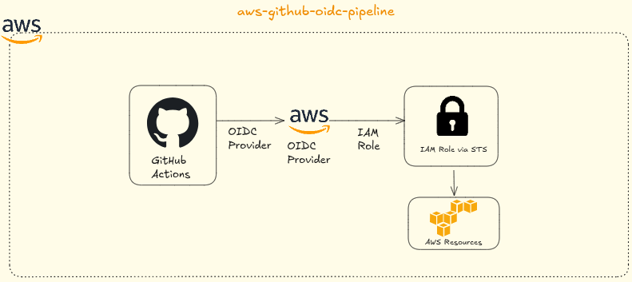

<div align="center">
  


# Autenticação OIDC GitHub Actions com AWS – CI/CD Seguro Sem Credenciais Estáticas

**Atualizado: 14 de Janeiro de 2026**

[](https://github.com/nicoleepaixao)
[](https://github.com/nicoleepaixao/github-actions-aws-oidc)
[](https://nicoleepaixao.medium.com/)

<p align="center">
  <a href="README-PT.md">🇧🇷</a>
  <a href="README.md">🇺🇸</a>
</p>


</div>

---

<p align="center">
  
</p>

## **O Problema**

A autenticação tradicional AWS em pipelines CI/CD depende de **credenciais de longa duração** armazenadas como GitHub Secrets. Cada workflow de deployment usa a mesma **Access Key** e **Secret Access Key** estáticas, o que introduz riscos significativos de segurança:

- **Credenciais nunca expiram** a menos que rotacionadas manualmente
- **Alto risco de vazamento** através de logs, erros ou repositórios comprometidos
- **Sem auditabilidade** de qual workflow ou job usou as credenciais
- **Secrets compartilhados** entre múltiplos workflows e ambientes

Este projeto resolve esse problema implementando **autenticação baseada em OIDC**, eliminando credenciais estáticas completamente. GitHub Actions solicita tokens temporários do AWS STS, que expiram automaticamente após o job ser concluído, garantindo **zero secrets de longa duração**.

---

## **Como Funciona**

Usando **OpenID Connect (OIDC)**, esta solução permite:

- **Credenciais temporárias** emitidas pelo AWS STS em cada execução de workflow
- **Nenhuma Access Key armazenada** em GitHub Secrets
- **Expiração automática** de credenciais (15 minutos a 12 horas)
- **Controle de acesso granular** via políticas de confiança IAM Role restritas a repositórios e branches específicos

O workflow GitHub Actions solicita um token OIDC, a AWS valida contra a política de confiança configurada, e retorna credenciais temporárias que funcionam apenas para aquela execução de job específica.

---

## **Pré-requisitos**

| **Requisito** | **Detalhes** |
|-----------------|-------------|
| **Conta AWS** | Com permissões IAM para criar provedores OIDC e roles |
| **Repositório GitHub** | Repo público ou privado com Actions habilitado |
| **AWS CLI** | Configurado com credenciais apropriadas |

---

## **Implementação Passo a Passo**

**Passo 1: Criar/Validar Provedor de Identidade OIDC**

A configuração do provedor OIDC GitHub:
- **URL:** `https://token.actions.githubusercontent.com`
- **Audience:** `sts.amazonaws.com`

Verificar se provedor existe:

```bash
aws iam list-open-id-connect-providers
```

Se você ver:
```text
arn:aws:iam::<ACCOUNT_ID>:oidc-provider/token.actions.githubusercontent.com
```

✅ Provedor já existe, pule para o passo 2.

Criar provedor (se necessário):

Recomendado: Use AWS Console (IAM → Identity providers → Add provider)
- URL do provedor: `https://token.actions.githubusercontent.com`
- Audience: `sts.amazonaws.com`

Via CLI (requer thumbprint):
```bash
aws iam create-open-id-connect-provider \
  --url https://token.actions.githubusercontent.com \
  --client-id-list sts.amazonaws.com \
  --thumbprint-list <THUMBPRINT>
```

---

**Passo 2: Criar IAM Role para GitHub Actions**

Criar `github-oidc-trust.json`:

```json
{
  "Version": "2012-10-17",
  "Statement": [
    {
      "Effect": "Allow",
      "Principal": {
        "Federated": "arn:aws:iam::<ACCOUNT_ID>:oidc-provider/token.actions.githubusercontent.com"
      },
      "Action": "sts:AssumeRoleWithWebIdentity",
      "Condition": {
        "StringEquals": {
          "token.actions.githubusercontent.com:aud": "sts.amazonaws.com"
        },
        "StringLike": {
          "token.actions.githubusercontent.com:sub": "repo:<OWNER>/<REPO>:ref:refs/heads/main"
        }
      }
    }
  ]
}
```

**Substituir:**
- `<ACCOUNT_ID>` - ID da sua conta AWS
- `<OWNER>` - Organização ou usuário GitHub (ex.: `nicoleepaixao`)
- `<REPO>` - Nome do repositório (ex.: `pipeline-nginx`)

Criar IAM Role:

```bash
aws iam create-role \
  --role-name github-oidc-deploy \
  --assume-role-policy-document file://github-oidc-trust.json
```

Salvar o ARN retornado:
```
arn:aws:iam::<ACCOUNT_ID>:role/github-oidc-deploy
```

---

**Passo 3: Anexar Permissões ao Role**

O role precisa de permissões para o que seu pipeline faz:

```bash
# Permissões ECR (push de imagens)
aws iam attach-role-policy \
  --role-name github-oidc-deploy \
  --policy-arn arn:aws:iam::aws:policy/AmazonEC2ContainerRegistryPowerUser

# Permissões ECS (deploy de tasks)
aws iam attach-role-policy \
  --role-name github-oidc-deploy \
  --policy-arn arn:aws:iam::aws:policy/AmazonECSFullAccess
```

⚠️ **Para produção:** Substituir com uma política customizada de privilégio mínimo.

---

## **Configuração GitHub Actions**

**Passo 4: Configurar Variáveis do Repositório**

No seu repositório GitHub:

1. Vá para **Settings** → **Secrets and variables** → **Actions** → **Variables**
2. Adicione variáveis:

| **Nome da Variável** | **Valor** |
|------------------|-----------|
| `AWS_ROLE_ARN_HOMOL` | `arn:aws:iam::<ACCOUNT_ID>:role/github-oidc-deploy-homol` |
| `AWS_ROLE_ARN_PROD` | `arn:aws:iam::<ACCOUNT_ID>:role/github-oidc-deploy-prod` |
| `AWS_REGION` | `us-east-1` |

**Nota:** ARNs não são sensíveis - use Variables ao invés de Secrets.

---

**Passo 5: Configuração do Workflow**

Exemplo de workflow completo:

```yaml
name: Deploy to AWS ECS

on:
  push:
    branches:
      - main

permissions:
  id-token: write   # Necessário para token OIDC
  contents: read    # Necessário para checkout

jobs:
  deploy:
    runs-on: ubuntu-latest
    
    steps:
      - name: Checkout code
        uses: actions/checkout@v4
      
      - name: Configure AWS credentials via OIDC
        uses: aws-actions/configure-aws-credentials@v4
        with:
          role-to-assume: ${{ vars.AWS_ROLE_ARN_HOMOL }}
          aws-region: ${{ vars.AWS_REGION }}
      
      - name: Verify AWS identity
        run: aws sts get-caller-identity
      
      - name: Login to Amazon ECR
        id: login-ecr
        uses: aws-actions/amazon-ecr-login@v2
      
      - name: Build and push Docker image
        env:
          ECR_REGISTRY: ${{ steps.login-ecr.outputs.registry }}
          ECR_REPOSITORY: my-app
          IMAGE_TAG: ${{ github.sha }}
        run: |
          docker build -t $ECR_REGISTRY/$ECR_REPOSITORY:$IMAGE_TAG .
          docker push $ECR_REGISTRY/$ECR_REPOSITORY:$IMAGE_TAG
      
      - name: Deploy to ECS
        env:
          CLUSTER_NAME: my-cluster
          SERVICE_NAME: my-service
        run: |
          aws ecs update-service \
            --cluster $CLUSTER_NAME \
            --service $SERVICE_NAME \
            --force-new-deployment
```

---

## **Configuração Multi-Ambiente**

**Roles Separadas para Homol e Prod**

Política de Confiança Homol (aceita branch `main`):

```json
{
  "Version": "2012-10-17",
  "Statement": [
    {
      "Effect": "Allow",
      "Principal": {
        "Federated": "arn:aws:iam::<ACCOUNT_ID>:oidc-provider/token.actions.githubusercontent.com"
      },
      "Action": "sts:AssumeRoleWithWebIdentity",
      "Condition": {
        "StringEquals": {
          "token.actions.githubusercontent.com:aud": "sts.amazonaws.com"
        },
        "StringLike": {
          "token.actions.githubusercontent.com:sub": "repo:<OWNER>/<REPO>:ref:refs/heads/main"
        }
      }
    }
  ]
}
```

Política de Confiança Prod (aceita apenas branch `release`):

```json
{
  "Version": "2012-10-17",
  "Statement": [
    {
      "Effect": "Allow",
      "Principal": {
        "Federated": "arn:aws:iam::<ACCOUNT_ID>:oidc-provider/token.actions.githubusercontent.com"
      },
      "Action": "sts:AssumeRoleWithWebIdentity",
      "Condition": {
        "StringEquals": {
          "token.actions.githubusercontent.com:aud": "sts.amazonaws.com"
        },
        "StringLike": {
          "token.actions.githubusercontent.com:sub": "repo:<OWNER>/<REPO>:ref:refs/heads/release"
        }
      }
    }
  ]
}
```

---

## **Validação e Testes**

**Verificar Configuração OIDC:**

```bash
# Verificar se provedor OIDC existe
aws iam list-open-id-connect-providers

# Verificar política de confiança do role
aws iam get-role --role-name github-oidc-deploy
```

**Passo de Validação no Workflow:**

Adicione isso ao seu workflow para confirmar identidade:

```yaml
- name: Verify AWS Identity
  run: |
    aws sts get-caller-identity
    echo "Assumed role successfully!"
```

Saída esperada:
```json
{
  "UserId": "AROAXXXXXXXXX:github-actions-session",
  "Account": "123456789012",
  "Arn": "arn:aws:sts::123456789012:assumed-role/github-oidc-deploy/github-actions-session"
}
```

---

## **Troubleshooting**

| **Erro** | **Causa** | **Solução** |
|-----------|-----------|-------------|
| `Could not assume role with OIDC` | Falta permissão `id-token: write` | Adicionar à seção `permissions` do workflow |
| `AccessDenied` durante deployment | Role não tem permissões necessárias | Anexar políticas IAM apropriadas |
| `Invalid identity token` | Incompatibilidade de política de confiança | Verificar se claim `sub` corresponde exatamente a repo/branch |
| `Provider not found` | Provedor OIDC não existe | Criar provedor no console IAM |

---

## **Melhores Práticas de Segurança**

| **Prática** | **Implementação** |
|--------------|-------------------|
| **Privilégio Mínimo** | Conceder apenas permissões necessárias ao role |
| **Restrições de Branch** | Limitar política de confiança a branches específicas |
| **Proteção de Ambiente** | Usar GitHub Environments com aprovações para prod |
| **Logs de Auditoria** | Habilitar CloudTrail para todas chamadas AssumeRole |
| **Roles Separadas** | Uma role por ambiente (homol/prod) |

**Exemplo de Política Customizada de Privilégio Mínimo:**

```json
{
  "Version": "2012-10-17",
  "Statement": [
    {
      "Effect": "Allow",
      "Action": [
        "ecr:GetAuthorizationToken",
        "ecr:BatchCheckLayerAvailability",
        "ecr:PutImage",
        "ecr:InitiateLayerUpload",
        "ecr:UploadLayerPart",
        "ecr:CompleteLayerUpload"
      ],
      "Resource": "*"
    },
    {
      "Effect": "Allow",
      "Action": [
        "ecs:UpdateService",
        "ecs:DescribeServices",
        "ecs:RegisterTaskDefinition",
        "ecs:DescribeTaskDefinition"
      ],
      "Resource": [
        "arn:aws:ecs:us-east-1:<ACCOUNT_ID>:service/my-cluster/*",
        "arn:aws:ecs:us-east-1:<ACCOUNT_ID>:task-definition/my-app:*"
      ]
    }
  ]
}
```

---

## **Principais Benefícios**

| **Benefício** | **Descrição** |
|-------------|-----------------|
| **Sem Credenciais de Longa Duração** | Nenhuma Access Key ou Secret armazenada no GitHub |
| **Rotação Automática** | Tokens expiram automaticamente (1 hora) |
| **Privilégio Mínimo** | Restringir acesso por repositório e branch |
| **Trilha de Auditoria** | Todas ações registradas no CloudTrail com contexto |
| **Seguro por Padrão** | Melhor prática da indústria recomendada pela AWS e GitHub |

---

## **Recursos Adicionais**

- [GitHub OIDC Documentation](https://docs.github.com/en/actions/deployment/security-hardening-your-deployments/configuring-openid-connect-in-amazon-web-services) - Guia oficial
- [AWS IAM OIDC Identity Providers](https://docs.aws.amazon.com/IAM/latest/UserGuide/id_roles_providers_create_oidc.html) - Setup de provedor
- [aws-actions/configure-aws-credentials](https://github.com/aws-actions/configure-aws-credentials) - GitHub Action
- [AWS Security Token Service (STS)](https://docs.aws.amazon.com/STS/latest/APIReference/welcome.html) - Referência STS

---

## **Conecte-se & Siga**

Mantenha-se atualizado com automação DevOps e melhores práticas:

<div align="center">

[](https://github.com/nicoleepaixao)
[](https://www.linkedin.com/in/nicolepaixao/)
[](https://medium.com/@nicoleepaixao)

</div>

---

## **Aviso Legal**

Esta configuração fornece credenciais temporárias com expiração automática. Sempre siga o princípio de privilégio mínimo e restrinja assumir role a repositórios e branches específicos. Teste em ambientes de não-produção antes de aplicar a cargas de trabalho de produção. Consulte documentação oficial da AWS e GitHub para as recomendações de segurança mais recentes.

---

<div align="center">

**Automatize seus deployments com confiança!**

*Documento Criado: 14 de Janeiro de 2026*

Made with ❤️ by [Nicole Paixão](https://github.com/nicoleepaixao)

</div>
